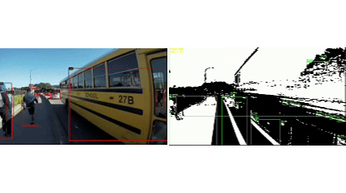

# DeepStream 8 with Background Subtractor — 2 RTSP Streams

Real-time video processing application based on **NVIDIA DeepStream 8** and **OpenCV Background Subtractor**.

The application receives an RTSP video stream, processes it in parallel using two different approaches, and provides **two independent RTSP output streams**.

---

## Results

<p align="center">
  
</p>

<p align="center">
  
</p>
---

## Overview

The project demonstrates how NVIDIA DeepStream and OpenCV can be combined in a single real-time video processing pipeline.

The input video stream is processed simultaneously by two branches:

1. **Background Subtractor branch**
   Uses OpenCV Background Subtractor to detect moving objects by separating the foreground from the background.

2. **NVIDIA DeepStream branch**
   Uses the standard `nvinfer` inference pipeline for neural-network-based object detection.

As a result, the application produces two independent RTSP streams that can be viewed simultaneously.

### Processing architecture

```text
                    ┌─────────────────────────┐
                    │       RTSP INPUT        │
                    │     rtsp://.../input    │
                    └────────────┬────────────┘
                                 │
                                 ▼
                    ┌─────────────────────────┐
                    │     DeepStream Pipeline │
                    │       / GStreamer       │
                    └────────────┬────────────┘
                                 │
                    ┌────────────┴────────────┐
                    │                         │
                    ▼                         ▼
          ┌──────────────────┐      ┌──────────────────┐
          │ Background       │      │ NVIDIA DeepStream│
          │ Subtractor       │      │ nvinfer           │
          │ (OpenCV)         │      │ Object Detection  │
          └────────┬─────────┘      └────────┬─────────┘
                   │                         │
                   ▼                         ▼
          ┌──────────────────┐      ┌──────────────────┐
          │ RTSP Output #1   │      │ RTSP Output #2   │
          └──────────────────┘      └──────────────────┘
```

---

## Features

* Real-time RTSP video input
* NVIDIA DeepStream 8 integration
* GStreamer-based video processing
* OpenCV Background Subtractor
* NVIDIA `nvinfer` inference pipeline
* Parallel processing of the same input stream
* Two independent RTSP output streams
* GPU-accelerated video decoding and encoding
* Real-time video analytics
* Suitable as a basis for further computer vision development

---

## Technologies

The project is based on the following technologies:

* **NVIDIA DeepStream 8**
* **GStreamer**
* **Python**
* **OpenCV**
* **NVIDIA `nvinfer`**
* **RTSP**
* **Docker**
* **CUDA / NVIDIA GPU acceleration**

DeepStream provides the GStreamer-based infrastructure for building GPU-accelerated video analytics pipelines, including hardware-accelerated decoding/encoding and TensorRT-based inference.

---

## Requirements

The application requires:

* NVIDIA GPU
* NVIDIA drivers
* Docker
* NVIDIA Container Toolkit
* NVIDIA DeepStream 8
* Python
* OpenCV
* GStreamer
* RTSP source

The recommended way to run the project is inside the NVIDIA DeepStream Docker container.

---

## Running with Docker

Start the DeepStream 8 container:

```bash
docker run --gpus all -it --rm \
    --network=host \
    --privileged \
    nvcr.io/nvidia/deepstream:8.0-gc-triton-devel
```

The `--network=host` option allows the container to access the RTSP streams and expose the generated RTSP streams directly through the host network.

---

## Clone the Repository

Clone the project:

```bash
git clone https://github.com/youngmarij/Deepstream8-with-Background-Substractor-2-rtsp-streams-.git
```

Enter the project directory:

```bash
cd Deepstream8-with-Background-Substractor-2-rtsp-streams-
```

---

## Input RTSP Stream

The application expects an RTSP stream as its input.

Example:

```text
rtsp://127.0.0.1:8554/input
```

Before running the application, make sure that the input RTSP stream is available.

You can test the stream with `ffplay`:

```bash
ffplay -i rtsp://127.0.0.1:8554/input
```

---

## RTSP Outputs

The application creates two independent RTSP output streams.

### Background Subtractor stream

This stream contains the result of OpenCV Background Subtractor processing.

It can be accessed using the corresponding RTSP endpoint configured by the application.

### NVIDIA Detection stream

The second stream contains the output of the NVIDIA DeepStream `nvinfer` pipeline.

The exact RTSP ports and mount points are defined in the project configuration/source code.

For example:

```text
rtsp://127.0.0.1:<port>/background
rtsp://127.0.0.1:<port>/detection
```

You can view either stream using:

```bash
ffplay -i rtsp://127.0.0.1:<port>/background
```

or:

```bash
ffplay -i rtsp://127.0.0.1:<port>/detection
```

---

## Background Subtraction

The first processing branch uses OpenCV Background Subtractor.

The algorithm estimates the background of the scene and identifies pixels that differ from the learned background model.

This allows moving objects to be separated from the static scene.

A simplified processing flow is:

```text
RTSP Frame
    │
    ▼
OpenCV
    │
    ▼
Background Subtractor
    │
    ▼
Foreground Mask
    │
    ▼
Processed Video
    │
    ▼
RTSP Output
```

This approach does not require a neural-network detector and can be useful for detecting movement in relatively static environments.

---

## NVIDIA DeepStream Detection

The second processing branch uses NVIDIA DeepStream's `nvinfer` element.

The general processing flow is:

```text
RTSP Frame
    │
    ▼
Hardware Decoder
    │
    ▼
nvstreammux
    │
    ▼
nvinfer
    │
    ▼
nvdsosd
    │
    ▼
Hardware Encoder
    │
    ▼
RTSP Output
```

The `nvinfer` plugin provides TensorRT-based inference for object detection, classification and segmentation.

---

## Why Two Processing Branches?

The project demonstrates two fundamentally different approaches to video analysis.

### Background Subtraction

Advantages:

* Does not require a trained neural network
* Relatively simple algorithm
* Useful for detecting motion
* Can work effectively in static-camera scenarios

Limitations:

* Sensitive to camera movement
* Sensitive to lighting changes
* Does not inherently identify object classes

### Neural Network Detection

Advantages:

* Can identify specific object classes
* More suitable for semantic object detection
* Can work in more complex scenes

Limitations:

* Requires a trained model
* Requires inference resources
* Performance depends on the selected model and hardware

The two approaches therefore solve different computer-vision tasks and can be useful for comparing classical computer vision with neural-network-based detection.

---

## Project Structure

The project is organized into separate components responsible for different parts of the video-processing pipeline.

A typical structure is:

```text
.
├── main.py
├── config.py
├── pipeline.py
├── probe.py
├── source.py
├── rtsp_server.py
├── ...
└── README.md
```

The exact structure may vary depending on the current version of the project.

### Main Components

**`main.py`**

Application entry point. Initializes the application and starts the processing pipeline.

**`config.py`**

Contains configuration parameters and constants used by different parts of the application.

**`pipeline.py`**

Responsible for constructing and linking the GStreamer / DeepStream processing pipeline.

**`source.py`**

Contains functionality related to RTSP input and source creation.

**`probe.py`**

Contains pad-probe logic used to access and process DeepStream metadata and video buffers.

**`rtsp_server.py`**

Responsible for configuring and launching the RTSP output server.

---

## Pipeline Concept

The main idea of the application is to receive one video stream and process it through two independent branches.

```text
                         INPUT
                           │
                           ▼
                    ┌─────────────┐
                    │ RTSP Source │
                    └──────┬──────┘
                           │
                           ▼
                    ┌─────────────┐
                    │   Decoder   │
                    └──────┬──────┘
                           │
                  ┌────────┴────────┐
                  │                 │
                  ▼                 ▼
        ┌─────────────────┐ ┌─────────────────┐
        │ OpenCV          │ │ DeepStream      │
        │ Background      │ │ nvinfer         │
        │ Subtractor      │ │                 │
        └────────┬────────┘ └────────┬────────┘
                 │                   │
                 ▼                   ▼
        ┌─────────────────┐ ┌─────────────────┐
        │ RTSP Server #1  │ │ RTSP Server #2  │
        └─────────────────┘ └─────────────────┘
```

This architecture makes it possible to compare the output of classical background-subtraction techniques with neural-network-based object detection using the same source video.

---

## Viewing the Streams

`ffplay` can be used to test the generated RTSP streams.

Example:

```bash
ffplay -i rtsp://127.0.0.1:<port>/<mount-point>
```

VLC or another RTSP-compatible video player can also be used.

---

## DeepStream

NVIDIA DeepStream is a streaming analytics toolkit designed for AI-based video and image understanding. It is built around GStreamer and provides GPU-accelerated video processing and inference capabilities.

The project uses DeepStream as the main framework for handling the video pipeline, decoding, processing, inference and output streaming.

For RTSP sources, DeepStream supports live video ingestion and multi-stream processing through its GStreamer-based architecture.

---

## Possible Applications

The architecture can be extended for applications such as:

* Video surveillance
* Motion detection
* Industrial monitoring
* Security systems
* Camera analytics
* Object detection
* Traffic monitoring
* Smart-camera systems
* Real-time video analysis

---

## Future Improvements

Possible future improvements include:

* Adding object tracking
* Improving background-subtraction stability
* Adding configurable detection thresholds
* Supporting multiple input RTSP streams
* Adding recording of processed streams
* Adding event-based notifications
* Adding additional neural-network models
* Improving error handling and logging
* Adding configuration files for pipeline parameters

---

## License

This project is intended for educational and research purposes.

NVIDIA DeepStream and its associated components are subject to their respective NVIDIA licenses and terms of use.

For details about NVIDIA DeepStream licensing and components, refer to the official NVIDIA DeepStream documentation and repository.

---

## Author

Developed as a practical project for real-time video processing and computer vision using NVIDIA DeepStream and OpenCV.
